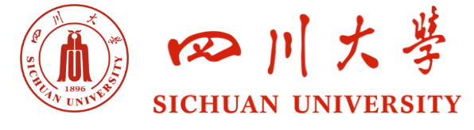

# 四川大学课程复习资料共享仓库
欢迎来到四川大学课程复习资料共享仓库！本仓库旨在为川大学子提供一个方便快捷的平台，共享和获取各类课程的复习资料，共同学习，共同进步。

## 课程资料目录
分为本科课程和研究生课程两个大类，以学院为单位进行分类，一门课程一个文件夹为组织方式。

## 贡献
欢迎任何形式的贡献！可以通过提交 `Issue` 或者 `Pull Request` 的方式，也可以通过以下邮箱联系我们：`3226855380@qq.com`。